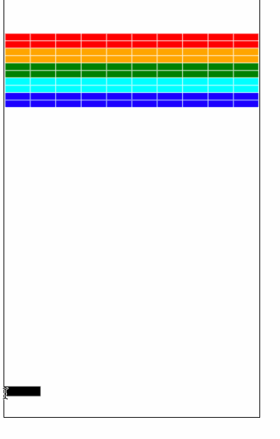
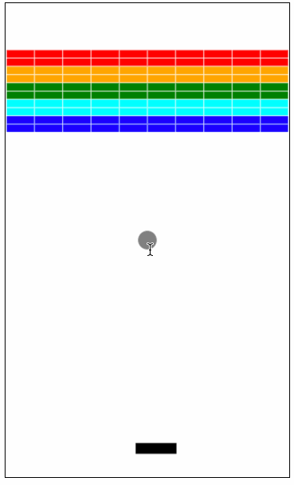

# Game - Breakout

[Click Here to Play](https://xinghom.github.io/JS_workout/.)

## Milestones:
- [x] Milestone 1: Set up the bricks
- [x] Milestone 2: Create the paddle

    

- [x] Milestone 3: Create a ball and get it to bounce off the walls
  
    

- [x] Milestone 4: Checking for collisions
- [x] Milestone 5: Finishing up
  - [x] defeat - to restart
  - [x] victory -  to restart

- [ ] Possible extensions
  - [x] gravity
  - [ ] score board ranking
  - [ ] Ultimation!!
